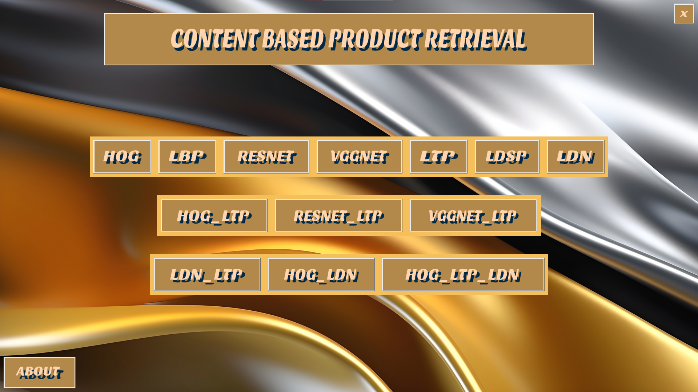
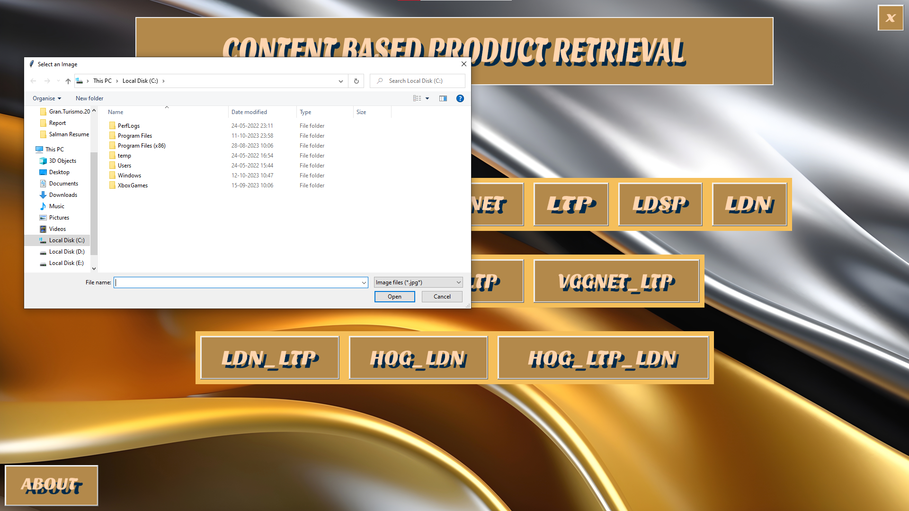
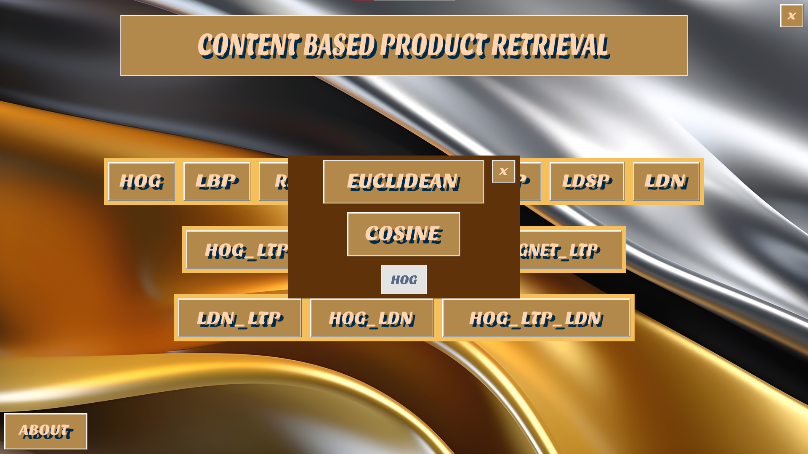
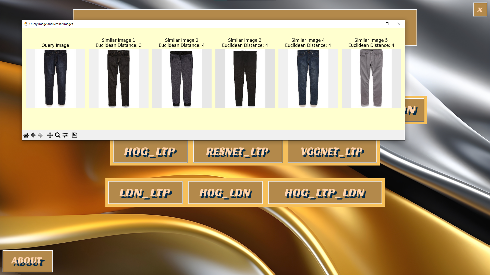

# Content-Based-Product-Retrieval

## About the Project

This project is about Content Based Product Retrieval. Entire project is made using python. We have made use of a LBP (Local Binary Pattern), LTP (Local Ternary Pattern), LDN (Local Directional Number), LDSN (Local Directional-structural Pattern), VGGNET (Visual Geometry Group Network), RESNET (Residual Networks) and HOG (Histogram of Oriented Gradients) feature extraction algorithms . It is a complete desktop application made using python Tkinter.

## Screenshots

    <b>Application Interface Home</b>

    <b>File Browser</b>

    <b>Similarity measure selection window</b>

    <b>Similar Images</b>

## Installation

You need to have anaconda installed.
You need to install all the python libraries.

## Technologies Used

1. Python
2. Python Tkinter

## System Requirements

Minimum Requirements

1. 8Gb RAM
2. Intel i5 processor
3. Hard disk 1Tb 
4. Optional: Graphic Card 

## Download Deep_Fashion_Dataset

https://mmlab.ie.cuhk.edu.hk/projects/DeepFashion.html
